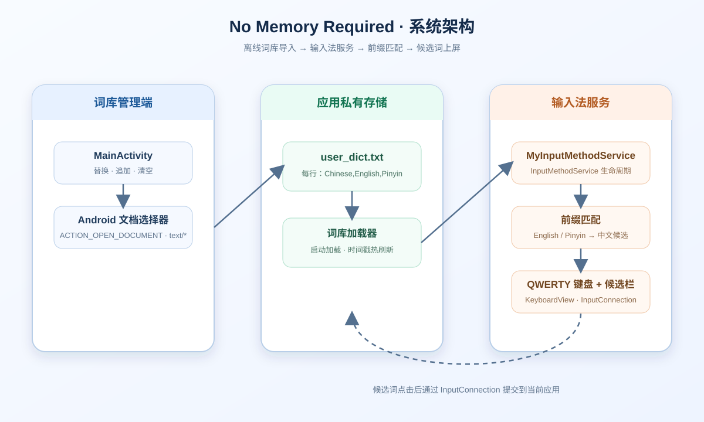

# No Memory Required

<p align="center">
  <strong>一个由个人词库驱动、离线运行的轻量级 Android 输入法</strong>
</p>

<p align="center">
  
  
  
</p>

<p align="center">
  <a href="#overview">项目简介</a> &middot;
  <a href="#features">核心能力</a> &middot;
  <a href="#architecture">架构图</a> &middot;
  <a href="#quick-start">快速开始</a> &middot;
  <a href="#dictionary-format">词库格式</a>
</p>

<a id="overview"></a>

## 项目简介

**No Memory Required** 是一个基于 Android 原生输入法框架实现的个人词库输入法。

它不依赖云端服务，也不内置复杂的预测模型，而是把一份简单、可编辑的词库加载到输入法服务中：用户输入英文或拼音前缀，输入法实时筛选对应的中文候选词，点击候选词即可上屏。

这个项目适合：

- 需要使用专有名词、术语或个人短语的开发者；
- 希望维护自己词库的语言学习者和翻译工作者；
- 想研究 Android `InputMethodService` 的开发者；
- 需要一个逻辑透明、行为可控的离线输入工具的用户。

> 导入词库 → 启用输入法 → 输入前缀 → 点击候选词。

<a id="features"></a>

## 核心能力

- **完全离线**：词库保存在应用私有目录 `user_dict.txt`，候选匹配在本地完成。
- **三种词库管理操作**：支持替换导入、追加导入和清空词库。
- **英文 / 拼音双前缀匹配**：对 `English` 和 `Pinyin` 字段执行不区分大小写的 `startsWith` 匹配。
- **候选栏交互**：匹配结果以可点击的中文候选词展示在键盘顶部。
- **输入会话自动刷新**：开始新的输入会话时，如果词库文件的修改时间发生变化，服务会自动重新加载词库。
- **原生实现**：使用 `InputMethodService`、`KeyboardView`、Android XML 布局和标准 `InputConnection` 完成输入链路。

<a id="architecture"></a>

## 架构图

架构图使用仓库内置 SVG，GitHub 页面可直接显示：

<p align="center">
  
</p>

### 一次输入的完整链路

1. 用户在 `MainActivity` 中选择一个文本词库文件。
2. Android 文档选择器将文件 URI 返回给应用。
3. 应用逐行读取文件，并将包含逗号的行写入 `user_dict.txt`。
4. `MyInputMethodService` 启动时加载词库；新的输入会话开始时检查文件修改时间。
5. 用户按下字母键后，字符进入 composing buffer，并通过 `InputConnection` 发送到当前文本框。
6. 服务使用英文字段和拼音字段进行前缀匹配，将中文字段生成候选项。
7. 用户点击候选项后，中文文本通过 `commitText` 提交到当前应用。

<a id="quick-start"></a>

## 快速开始

### 环境要求

- Android Studio；
- JDK 11；
- Android SDK；
- Android 7.0（API 24）或更高版本的设备 / 模拟器。

### 获取项目

```bash
git clone https://github.com/flupke91/No-Memory-Required.git
cd No-Memory-Required
```

### 构建 Debug APK

macOS / Linux：

```bash
./gradlew assembleDebug
```

Windows PowerShell：

```powershell
.\gradlew.bat assembleDebug
```

生成的 APK 位于：

```text
app/build/outputs/apk/debug/app-debug.apk
```

也可以直接使用 Android Studio 打开项目并运行 `app` 配置。


<a id="dictionary-format"></a>

## 启用输入法

安装 APK 后：

1. 打开 **No Memory Required** 应用。
2. 先导入一份词库文件。
3. 打开系统设置中的 **系统 → 语言和输入法 → 屏幕键盘**。
4. 启用 **No Memory Required**。
5. 在任意文本输入框中，通过系统输入法切换按钮切换到本输入法。
6. 输入英文或拼音前缀，点击候选栏中的中文词条。

不同 Android 版本和手机厂商的设置名称可能略有差异。

## 词库格式

每行一个词条，使用三个英文逗号分隔字段：

```text
English,Chinese,Pinyin
```

示例：

```text
milestone,里程碑,lichengbei
dock,码头,matou
blueprint,蓝图,lantu
astronaut,宇航员,yuhangyuan
```

字段含义：

| 字段 | 作用 | 示例 |
| --- | --- | --- |
| `English` | 英文关键词，支持前缀匹配 | `milestone` |
| `Chinese` | 点击候选后实际提交的中文文本 | `里程碑` |
| `Pinyin` | 拼音关键词，支持前缀匹配 | `lichengbei` |

### 导入模式

| 操作 | 实际行为 |
| --- | --- |
| **替换导入** | 使用选中文件中的有效行覆盖现有 `user_dict.txt`。 |
| **追加导入** | 将选中文件中的有效行追加到现有词库末尾。 |
| **清空词库** | 删除应用私有目录中的 `user_dict.txt`。 |

> 当前实现只会保留包含逗号的行；输入法解析时要求至少有三个逗号分隔字段。词条中的逗号暂不支持转义。

## 项目结构

```text
.
├── app/
│   └── src/main/
│       ├── java/com/example/myinputmethodservice/
│       │   ├── MainActivity.java              # 词库管理页面、文件导入与清空
│       │   └── MyInputMethodService.java      # 输入法服务、键盘与候选词逻辑
│       ├── res/layout/
│       │   ├── activity_main.xml               # 词库管理界面
│       │   └── input_method.xml                # 候选栏与键盘容器
│       ├── res/xml/
│       │   ├── method.xml                      # 输入法服务元数据
│       │   └── qwerty.xml                      # QWERTY 键盘定义
│       └── AndroidManifest.xml                 # Activity 与输入法 Service 声明
├── docs/
│   └── architecture.svg                        # 项目架构图
├── build.gradle.kts
├── settings.gradle.kts
└── gradlew / gradlew.bat
```

## 技术实现

| 模块 | 实现 |
| --- | --- |
| 应用入口 | `MainActivity` |
| 输入法服务 | `MyInputMethodService` |
| 输入法框架 | Android `InputMethodService` |
| 键盘 | `KeyboardView` + `res/xml/qwerty.xml` |
| 候选栏 | `HorizontalScrollView` + 动态 `TextView` |
| 数据存储 | 应用私有文件 `user_dict.txt` |
| 匹配方式 | English / Pinyin 字段的大小写不敏感前缀匹配 |
| 最低版本 | API 24 |
| 目标版本 | API 36 |
| Java 版本 | Java 11 |

## 当前边界

- 当前词库使用逗号分隔，包含逗号的字段无法表达。
- 候选词只做前缀匹配，不做词频排序、去重和分页。
- 键盘使用项目内置的 QWERTY XML 布局。
- 没有联网同步、账号系统或云端词库。
- 该项目是轻量级、确定性的个人输入工具，不是完整的智能预测输入法。

## 后续方向

- 增加词频、优先级和候选排序；
- 支持 TSV / JSON 等更稳健的词库格式；
- 导入前增加字段校验、重复检测和错误提示；
- 增加主题、布局和无障碍能力；
- 增加词库解析与候选匹配的自动化测试。

## 参与贡献

欢迎提交 Issue 和 Pull Request。涉及词库解析或候选匹配的改动，建议同时提供：

1. 变更前后的用户行为说明；
2. 验证使用的 Android 版本或设备信息；
3. 一份最小可复现词库样例。

## 许可证

仓库当前未包含 `LICENSE` 文件。若要发布衍生 APK 或将项目集成到其他产品，请先确认并补充合适的开源许可证。

<details>
<summary>English summary</summary>

## English summary

**No Memory Required** is a small offline Android input method backed by a user-managed dictionary. `MainActivity` imports, appends, replaces, or clears `user_dict.txt`. `MyInputMethodService` loads that file, matches English or Pinyin prefixes, renders Chinese candidates, and commits the selected candidate through `InputConnection`.

Build with:

```bash
./gradlew assembleDebug
```

Dictionary format:

```text
English,Chinese,Pinyin
```

The repository includes a visible architecture diagram at [`docs/architecture.svg`](./docs/architecture.svg).

</details>
