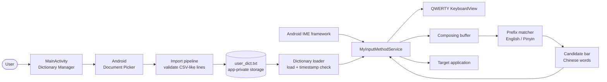

# No Memory Required

<p align="center">
  <strong>A tiny, offline-first Android IME powered by your own vocabulary.</strong>
</p>

<p align="center">
  
  
  
</p>

## Why this project?

Most input methods try to become an entire language platform. **No Memory Required** takes the opposite approach: provide a small, understandable keyboard that turns a personal dictionary into an offline candidate bar.

It is designed for developers, language learners, translators, and anyone who needs a deterministic vocabulary-driven input experience without a remote service, account, or cloud sync.

> Import a vocabulary. Enable the keyboard. Type a prefix. Choose a candidate.

## Highlights

- **Offline by design** — vocabulary is stored in the app's private storage and queried locally.
- **Personal dictionary workflow** — replace, append, or clear dictionary entries from the companion activity.
- **English + Pinyin lookup** — type an English or Pinyin prefix to surface the corresponding Chinese candidate.
- **Fast refresh** — the input service checks the dictionary timestamp when a new input session starts and reloads changes automatically.
- **Native Android implementation** — built on `InputMethodService`, `KeyboardView`, Android XML layouts, and the standard IME lifecycle.
- **Small surface area** — intentionally simple code and data flow make the project easy to inspect, fork, and customize.

## Architecture



### Runtime flow

1. `MainActivity` opens Android's document picker and imports text entries.
2. Valid lines are written to the app-private file `user_dict.txt`.
3. `MyInputMethodService` loads the dictionary when the service starts.
4. When a new input session begins, the service checks whether the file changed and reloads it if necessary.
5. Letter key presses are kept in a composing buffer and sent to the target app as composing text.
6. English/Pinyin prefix matches are rendered as clickable Chinese candidates.
7. Selecting a candidate commits the Chinese text through the current `InputConnection`.

## Getting started

### Prerequisites

- Android Studio with Android SDK support
- JDK 11
- An Android device or emulator running Android 7.0 (API 24) or newer

### Build and install

Clone the repository and open it in Android Studio:

```bash
git clone https://github.com/flupke91/No-Memory-Required.git
cd No-Memory-Required
```

Build a debug APK from the command line:

```bash
./gradlew assembleDebug
```

On Windows:

```powershell
.\gradlew.bat assembleDebug
```

The generated APK is located at:

```text
app/build/outputs/apk/debug/app-debug.apk
```

You can also run the `app` configuration directly from Android Studio.

## Enable the keyboard

After installing the app:

1. Open **No Memory Required** and import a dictionary file.
2. Open Android **Settings → System → Languages & input → On-screen keyboard**.
3. Enable **No Memory Required**.
4. Open any text field and switch to the new keyboard from the input-method picker.
5. Type an English or Pinyin prefix and tap a candidate in the suggestion bar.

The exact settings labels can vary between Android versions and device manufacturers.

## Dictionary format

Use one entry per line with three comma-separated fields:

```text
English,Chinese,Pinyin
```

Example:

```text
milestone,里程碑,lichengbei
dock,码头,matou
blueprint,蓝图,lantu
astronaut,宇航员,yuhangyuan
```

The importer keeps lines containing a comma. The input service uses entries with at least three fields and performs a case-insensitive prefix match against the English and Pinyin columns.

### Import modes

| Mode | Behavior |
| --- | --- |
| **Replace** | Replaces the current `user_dict.txt` with the selected file's valid lines. |
| **Append** | Adds the selected file's valid lines to the existing dictionary. |
| **Clear** | Deletes the stored dictionary and returns to the empty/default state. |

## Project structure

```text
.
├── app/
│   └── src/main/
│       ├── java/com/example/myinputmethodservice/
│       │   ├── MainActivity.java              # Dictionary management UI
│       │   └── MyInputMethodService.java      # IME service and candidate logic
│       ├── res/layout/
│       │   ├── activity_main.xml               # Import and status screen
│       │   └── input_method.xml                # Candidate bar + keyboard shell
│       ├── res/xml/
│       │   ├── method.xml                      # IME metadata
│       │   └── qwerty.xml                      # Keyboard definition
│       └── AndroidManifest.xml                 # Activity and IME service
├── build.gradle.kts
├── settings.gradle.kts
└── gradlew / gradlew.bat
```

## Technical profile

| Area | Current implementation |
| --- | --- |
| Language | Java |
| UI | Android XML layouts |
| Input framework | `InputMethodService` + `KeyboardView` |
| Storage | App-private `user_dict.txt` |
| Matching | Case-insensitive `startsWith` on English and Pinyin |
| Min SDK | API 24 |
| Target SDK | API 36 |
| Java compatibility | Java 11 |

## Current limitations

- The dictionary parser treats commas as field separators; entries containing commas are not supported.
- Matching is prefix-based and currently does not rank, deduplicate, or paginate candidates.
- The keyboard layout is based on the bundled QWERTY XML definition.
- Android settings paths differ across manufacturers.
- The project currently focuses on a compact, deterministic workflow rather than a full predictive IME.

## Roadmap ideas

- Add candidate ranking and frequency-aware ordering.
- Support richer dictionary formats such as TSV or JSON.
- Add dictionary validation and duplicate detection before import.
- Improve accessibility, theming, and keyboard layout customization.
- Add automated build checks and instrumentation coverage for import and matching behavior.

## Contributing

Issues and focused pull requests are welcome. When proposing a change, please include:

1. The user-facing behavior that changes.
2. The Android version/device context used for verification.
3. A minimal dictionary sample when the change affects parsing or matching.

## License

No license file is currently included in the repository. Add or confirm a license before distributing derivative binaries or incorporating the project into another product.


